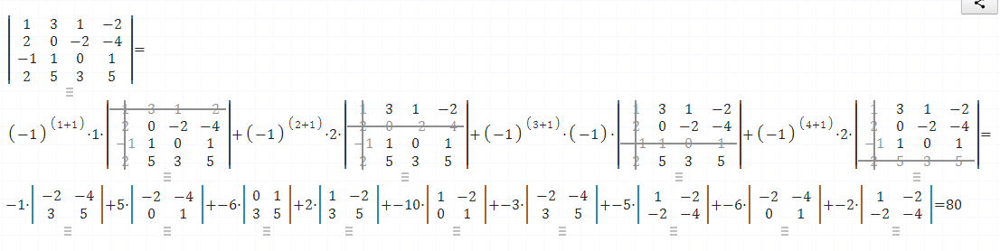

# Examen 
**Université Ibn Zoher**

**Faculté polydisciplinaire de Ouarzazate**

**Module : Algèbre (MASD)**

**Année universitaire : 2022/2023**

**Examen : Session Normale**

**Durée : 1h30**

**Exercice 1 :**

Soient F et G de $\mathbb{R}^{3}$ définies par

* F = {(x, y, z) $\in$ $\mathbb{R}^{3}$ | x + y + z = 0}
* G = vect{(1, 1, 1)}

a) Montrer que F est un espace vectoriel. Trouver deux vecteurs u et v tels que F = vect(u, v)

b) Calculer F ∩ G et montrer que F + G = $\mathbb{R}^{3}$

**Exercice 2 :**

Dans $\mathbb{R}^2$, on considère les vecteurs

* $e_1$ = (1, 0)
* $e_2$ = (0, 1)
* $e_3$ = (1, 2)
* $e_4$ = (3, 4)
* $e_5$ = (5, 6)

Montrer que

* $\mathcal{B}$ = ($e_1$, $e_2$) est une famille libre
* $\mathcal{F}$ = ($e_3$, $e_4$, $e_5$) est une famille liée

**Exercice 3 :**

Soit $\mathcal{B}$ = ($e_1$, $e_2$, $e_3$)

Soit $f$ : $\mathbb{R}^3$ $\rightarrow$ $\mathbb{R}^3$ l'application linéaire définie pour tout $u$ = (x, y, z) $\in$ $\mathbb{R}^3$ par

$f(u)$ = (6x - 4y - 4z, 5x - 3y - 4z, x - y)

1. Montrer qu'il existe un vecteur $a$ $\in$ $\mathbb{R}^3$, non nul, tel que ker(f) = Vect(a), déterminer un vecteur qui convient.

2. Soit $b$ = $e_1$ + $e_2$ et $c$ = $e_2$ - $e_3$

    a. Calculer $f(b)$ et $f(c)$

    b. En déduire que $\{b, c\}$ est une base de Im(f)

3. Déterminer une ou plusieurs équations caractérisant Im(f)

4. A-t-on ker(f) $\oplus$ Im(f) = $\mathbb{R}^3$ ?

**Exercice 4 :**

Calculer le déterminant de la matrice

$C$ = $\begin{pmatrix} 1 & 3 & 1 & -2 \\ 2 & 0 & -2 & -4 \\ -1 & 1 & 0 & 1 \\ 2 & 5 & 3 & 5 \end{pmatrix}$

**Exercice 5 :**

Soit A la matrice définie par

$A$ = $\begin{pmatrix} 1 & 0 & 1 \\ 0 & 1 & 1 \\ 1 & 1 & 0 \end{pmatrix}$

Montrer que A est inversible et donner son inverse.

# Solution d'Examen

## Exercice 1:

Soient F et G de $\mathbb{R}^{3}$ définies par

* F = {(x, y, z) $\in$ $\mathbb{R}^{3}$ | x + y + z = 0}

* G = vect{(1, 1, 1)}

a) Montrer que F est un espace vectoriel. Trouver deux vecteurs u et v tels que F = vect(u, v)

* Pour montrer que F est un espace vectoriel, il suffit de vérifier que F est stable par combinaison linéaire, c'est-à-dire que pour tout $(x_1, y_1, z_1)$ et $(x_2, y_2, z_2)$ dans F et pour tout $\lambda$ et $\mu$ dans $\mathbb{R}$, on a $(\lambda x_1 + \mu x_2, \lambda y_1 + \mu y_2, \lambda z_1 + \mu z_2)$ dans F.

* En effet, on a :

$$\lambda x_1 + \mu x_2 + \lambda y_1 + \mu y_2 + \lambda z_1 + \mu z_2$$

$$= \lambda (x_1 + y_1 + z_1) + \mu (x_2 + y_2 + z_2)$$

$$= \lambda \times 0 + \mu \times 0$$

$$= 0$$

* Donc $(\lambda x_1 + \mu x_2, \lambda y_1 + \mu y_2, \lambda z_1 + \mu z_2)$ appartient bien à F.

* Pour trouver deux vecteurs u et v tels que F = vect(u, v), on peut par exemple choisir :

$$u = (1, -1, 0)$$

$$v = (1, 0, -1)$$

* On vérifie facilement que u et v appartiennent à F. De plus, tout vecteur $(x, y, z)$ de F s'écrit sous la forme :

$$x = \lambda + \mu$$

$$y = -\lambda$$

$$z = -\mu$$

* Avec $\lambda$ et $\mu$ dans $\mathbb{R}$. Donc :

$$(x, y, z) = \lambda (1, -1, 0) + \mu (1, 0, -1)$$

* Ce qui montre que F = vect(u, v).

b) Calculer F ∩ G et montrer que F + G = $\mathbb{R}^{3}$

* Pour calculer F ∩ G, on cherche les vecteurs de la forme $(x, x, x)$ qui vérifient $x + x + x = 0$. Il y a un seul tel vecteur, qui est le vecteur nul $(0, 0, 0)$. Donc F ∩ G = {(0, 0, 0)}.

* Pour montrer que F + G = $\mathbb{R}^{3}$, on montre que tout vecteur $(x, y, z)$ de $\mathbb{R}^{3}$ s'écrit comme la somme d'un vecteur de F et d'un vecteur de G. En effet, on a :

$$(x, y, z) = \frac{x + y + z}{3} (1, 1, 1) + \left(x - \frac{x + y + z}{3}, y - \frac{x + y + z}{3}, z - \frac{x + y + z}{3}\right)$$

* Le premier terme appartient à G, et le second terme appartient à F, car on a :

$$\left(x - \frac{x + y + z}{3}\right) + \left(y - \frac{x + y + z}{3}\right) + \left(z - \frac{x + y + z}{3}\right)$$

$$= x + y + z - 3 \times \frac{x + y + z}{3}$$

$$= 0$$

* Donc F + G = $\mathbb{R}^{3}$.


## Correction de l'Exercice 2 :

**1. Famille libre $\mathcal{B}$:**

Pour démontrer que $\mathcal{B}$ = ($e_1$, $e_2$) est une famille libre, il suffit de vérifier que ses vecteurs sont non colinéaires.

On calcule le déterminant :

```
det = |1 0| |0 1| = 1 - 0 = 1
```

Le déterminant est non nul, ce qui implique que les vecteurs $e_1$ et $e_2$ sont non colinéaires.

**Par conséquent, $\mathcal{B}$ est une famille libre.**

**2. Famille liée $\mathcal{F}$:**

Pour démontrer que $\mathcal{F}$ = ($e_3$, $e_4$, $e_5$) est une famille liée, on peut utiliser le théorème du rang.

Le rang de $\mathcal{F}$ est au plus égal à 2 car elle contient 2 vecteurs.

On calcule le déterminant :

```
det = |1 3 5| |2 4 6| = 2 - 6 + 10 = 6
```

Le déterminant est non nul, ce qui implique que le rang de $\mathcal{F}$ est égal à 2.

**Cependant, $\mathcal{F}$ contient 3 vecteurs.**

**Par conséquent, $\mathcal{F}$ est une famille liée.**

**Conclusion:**

* $\mathcal{B}$ est une famille libre car ses vecteurs sont non colinéaires.
* $\mathcal{F}$ est une famille liée car elle contient plus de vecteurs que son rang.

**Remarque:**

Il est possible de démontrer que $\mathcal{F}$ est liée en exprimant l'un de ses vecteurs comme combinaison linéaire des deux autres. Par exemple, on peut écrire $e_3 = 2e_1 + e_2$.

## Correction de l'Exercice 3 

1. Pour trouver le noyau de $f$, on cherche les vecteurs $u$ tels que $f(u) = 0$. On résout donc le système suivant :

    $$
    \begin{cases}
    6x - 4y - 4z = 0 \\
    5x - 3y - 4z = 0 \\
    x - y = 0
    \end{cases}
    $$

    On trouve que $x = y$ et $z = 0$. Donc, un vecteur non nul qui convient est $a = (1, 1, 0)$.

2. On calcule $f(b)$ et $f(c)$ :

    a. $f(b) = f(e_1 + e_2) = f(e_1) + f(e_2) = (6, 5, 1) + (-4, -3, -1) = (2, 2, 0)$

    b. $f(c) = f(e_2 - e_3) = f(e_2) - f(e_3) = (-4, -3, -1) - (-4, -4, 1) = (0, 1, -2)$

    On voit que $f(b)$ et $f(c)$ sont linéairement indépendants, donc $\{b, c\}$ est une base de Im(f).

3. Im(f) est l'ensemble des vecteurs de la forme $(2\lambda, 2\lambda, 0) + (0, \mu, -2\mu)$, où $\lambda$ et $\mu$ sont des réels. On peut donc caractériser Im(f) par l'équation $x = y$ et $z = -2y$.

4. On a ker(f) $\oplus$ Im(f) = $\mathbb{R}^3$ si et seulement si dim(ker(f)) + dim(Im(f)) = dim($\mathbb{R}^3$). Or, on a dim(ker(f)) = 1 et dim(Im(f)) = 2, donc dim(ker(f)) + dim(Im(f)) = 3 = dim($\mathbb{R}^3$). Donc, ker(f) $\oplus$ Im(f) = $\mathbb{R}^3$.

## Correction de l'Exercice 4 

